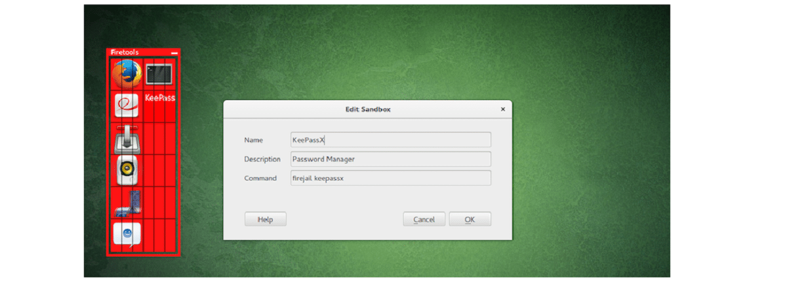

# PPS-Unidad1-Actividad4-JulioManuelTatoPulido

Tenemos varios objetivos:

> [Buscar distintas alternativas de una Sandbox](#alternativas-de-sandboxs)

> [Crear el proyecto y probarlo](#crear-el-proyecto-y-probarlo)

---
## Alternativas de Sandboxs

Hay diferentes aplicaciones con las que puedes tener una Sandbox, en las cuáles se puede hacer un estudio de las consecuencias y de los riesgos en un estado de aislamiento para no perjudicar a nuestro ordenador:

- Firejail → Ligera y fácil de usar en Linux. Restringe el acceso de las aplicaciones al sistema.

  

- AppArmor → Mecanismo de seguridad en Linux que permite definir perfiles de restricción para aplicaciones.
- SELinux → Similar a AppArmor, pero con un control más granular sobre permisos y accesos.
- Bubblewrap → Minimalista y utilizado en sistemas Linux para aislar procesos.
- Sandboxie Plus → Versión moderna de Sandboxie, útil en Windows para aislar aplicaciones sospechosas.

## Crear el proyecto y probarlo

Las dos extensiones que comentaré a continuación han sido instalados en Visual Studio, que va a ser el IDE que vaya a utilizar en estas prácticas.

### Checkstyle

Checkstyle es un plugin que se utiliza para verificar que el código siga un estándar de estilo definido. Es ideal para mantener la coherencia en equipos grandes, revisando el formato y la estructura del código automáticamente.

  

