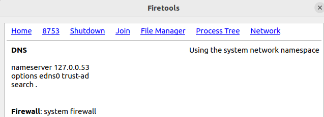

# PPS-Unidad1-Actividad4-JulioManuelTatoPulido

# PPS-Unidad1-Actividad1-JulioManuelTatoPulido

Tenemos varios objetivos:

> [Crear un entorno de desarrollo Eclipse con docker](#Eclipse-Docker)

> [Instalar extensiones en un IDE](#Instalar-extensiones)

> [Probar los entornos de Desarrollo](#Prueba-entornos) 
---
## Eclipse Docker

1. Primero creamos las carpetas necesarias y cambiamos el propietario:
~~~
sudo mkdir -p  $HOME/docker/eclipse/datos
sudo chown -R kali:kali eclipse
~~~

2. Configuramos el entorno gráfico:

~~~
export DISPLAY=:0
startxwin -- -listen tcp &
xhost + 
~~~

3. Lanzamos el contenedor:

~~~
sudo docker run -ti --rm \
           --ulimit nofile=8096:8096\
           -e DISPLAY=$DISPLAY \
	       -e artifactory_host='IP:PUERTO'\
		   --name eclipse \
           -v /tmp/.X11-unix:/tmp/.X11-unix \
           -v `pwd`:/workspace \
           -v $HOME/docker/eclipse/datos:/home/developer \
           dockeruc/eclipse
~~~

  

## Instalar extensiones

Las dos extensiones que comentaré a continuación han sido instalados en Visual Studio, que va a ser el IDE que vaya a utilizar en estas prácticas.

### Checkstyle

Checkstyle es un plugin que se utiliza para verificar que el código siga un estándar de estilo definido. Es ideal para mantener la coherencia en equipos grandes, revisando el formato y la estructura del código automáticamente.

  

### Sonar Lint

SonarLint es un pligun que se utiliza para corregir el código en tiempo real. Detecta errores, vulnerabilidades y problemas de calidad mientras escribes, y funciona con varios lenguajes. Además, ayuda a mejorar la seguridad y limpieza del código desde el principio.

  

## Prueba entornos

Para empezar he instalado en Visual Studio la extensión de Python:

  

Después he instalado en mi Windows la aplicación de Python 3.11:

  

Después, he accedido al repoistorio del profesor, donde nos ha dejado diferentes proyectos de calculadoras, para poder probarlos en nuestro IDE:

  

Pudiendo comprobarlo así con la extensión instalado en Visual Studio:

  

